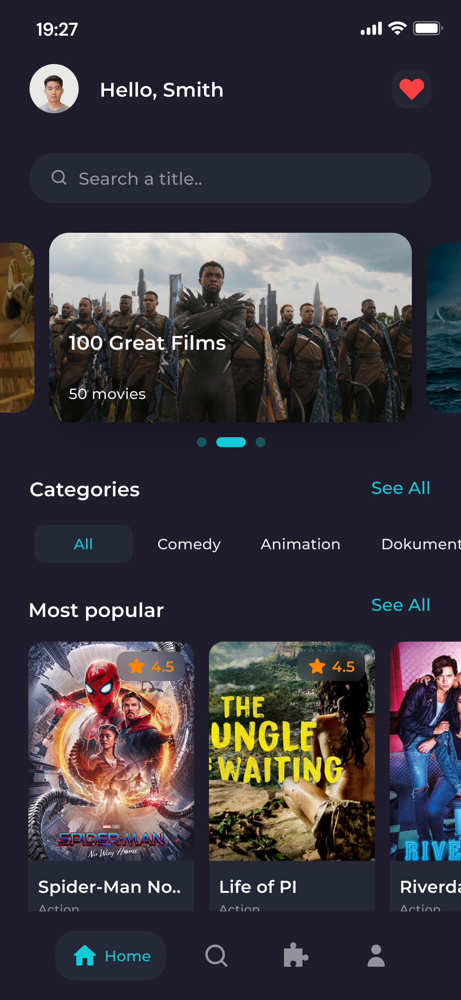
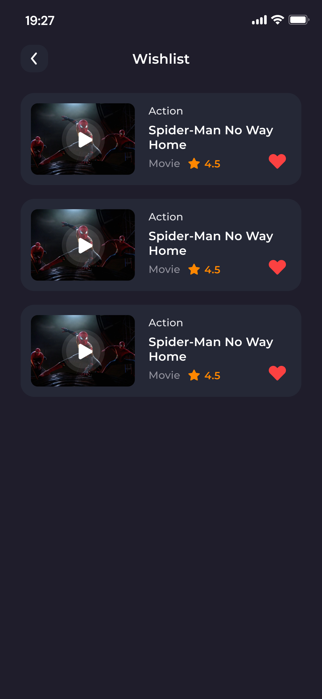
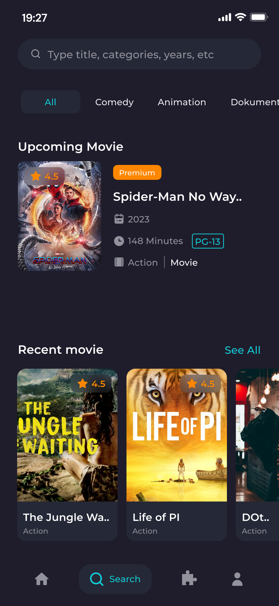

# Приложение "Movie For Today"

Приложение “Movie for today” - это приложение для просмотров фильмов и сериалов. 

## Команда разработчиков / Developers *(team 6)*: 

* [Alexander *(teamleader)*](https://github.com/alexrybachev)
* [Ilya](https://github.com/ShapovalovIlya)
* [Daniil](https://github.com/Senior-Pomidorr)
* [Alexander](https://github.com/Lepiozdyx)
* [Mirsait](https://github.com/Mirsaitoch) 
* [Andrey](https://github.com/MrMurman)

## Дизайн приложения
[Figma](https://www.figma.com/file/9a49Wl4Un4PUXk1NdhNz93/Movie-for-today?type=design&node-id=5%3A2&mode=design&t=tbYnAVRe6629kxFn-1)

## Онбоардинг экран

## Главный экран
- Сверху экрана аватар, имя и кнопка для перехода в любимые фильмы
- Search Bar который ищет фильмы по названию
- Коллекция Movie List, в которой коллекции фильмов
- Коллекция Popular Movie, в которой популярные фильмы или лучшие

## Экран Popular Movie
- Отображаем список популярных фильмов

## Экран Movie Detail
- На этом экране показываем полную информацию о фильме
- По кнопке трейлер переход на просмотр трейлера, а при нажатии на кнопку full film - просмотр целого фильма (в случае его наличия)

## Экран Wishlist(он же избранное)
- На этом экране показываем избранные фильмы (попасть можно через home экран).

## Экран Search
- На этом экране идет более подробный поиск
- Ниже коллекцию или 1 фильм который скоро выйдет
- Внизу коллекция recent

## Экран Profile
- На этом экране показываем данные профиля
- Notification и Language (заглушки)
- About us -  про команду

## Экран Christmas tree
- Экран с елочкой, на которой игрушки шарики. При нажатии появляется рекомендация новогоднего фильма
- Рекомендации не повторяются (их 30 штук)

